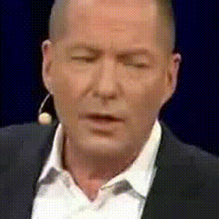

# USR 2.0

**Pay Attention to CTC: Fast and Robust Pseudo-Labelling for Unified Speech Recognition**

A unified model for **audio**, **visual**, and **audio-visual** speech recognition.

<p align="center">
  <a href="#installation">Installation</a> &bull;
  <a href="#transcribe-a-video">Demo</a> &bull;
  <a href="#extract-encoder-features">Features</a> &bull;
  <a href="#pretrained-models">Models</a> &bull;
  <a href="#evaluation">Evaluation</a> &bull;
  <a href="#citation">Citation</a>
</p>

<table align="center">
<tr>
<td valign="middle"></td>
<td valign="middle"></td>
<td valign="middle"><h3>"WE DON'T USE VIDEO, WE DON'T USE AUDIO"</h3></td>
</tr>
</table>

---

## Installation

```bash
pip install -r requirements.txt
```

### Face landmark detector

A face landmark detector is required for mouth cropping (used by `demo.py`, `extract_features.py`, and `preprocessing/extract_mouths.py`). Two backends are supported:

**Option A: MediaPipe (recommended — simple pip install)**
```bash
pip install mediapipe
```

**Option B: ibug RetinaFace + FAN (original, higher accuracy)**

The ibug packages are not on PyPI and must be installed from source. A helper script is provided:
```bash
bash preprocessing/setup_ibug.sh
```
This clones and installs [ibug face_detection](https://github.com/hhj1897/face_detection) and [ibug face_alignment](https://github.com/hhj1897/face_alignment). Requires `git-lfs`.

---

## Transcribe a Video

Run `demo.py` to transcribe a video. Face detection and mouth cropping are handled automatically.

Download a pretrained model before running. The [Huge (high-resource)](https://drive.google.com/file/d/1LzFOTYu45zCLOHGVLQt7pMGjw6jmmo9Y/view?usp=sharing) checkpoint is recommended for best accuracy. For a lighter alternative, use [Base+ (high-resource)](https://drive.google.com/file/d/18vmJjdem5XPOA8bmizybIW5sLJuHMdRR/view?usp=sharing). See [Pretrained Models](#pretrained-models) for all options.

```bash
python demo.py \
  video=path/to/video.mp4 \
  model.pretrained_model_path=path/to/checkpoint.pth
```

Output:
```
============================================================
 Modality : av
 Video    : path/to/video.mp4
 Result   : THE QUICK BROWN FOX JUMPS OVER THE LAZY DOG
============================================================
```

### Modalities

```bash
# Audio-visual (default)
python demo.py video=video.mp4 model.pretrained_model_path=model.pth

# Lip reading only
python demo.py video=video.mp4 model.pretrained_model_path=model.pth modality=v

# Audio only
python demo.py video=video.mp4 model.pretrained_model_path=model.pth modality=a
```

### Using a different model size

```bash
python demo.py video=video.mp4 model.pretrained_model_path=model.pth \
  model/backbone=resnet_transformer_large
```

Any [Hydra](https://hydra.cc/) override works. For example, to change beam size: `decode.beam_size=10`.

---

## Extract Encoder Features

Extract learned representations for downstream tasks.

```bash
# All modalities (saves video, audio, and audio_visual features)
python extract_features.py \
  video=path/to/video.mp4 \
  model.pretrained_model_path=path/to/checkpoint.pth \
  output=features.pt

# Single modality
python extract_features.py \
  video=path/to/video.mp4 \
  model.pretrained_model_path=path/to/checkpoint.pth \
  modality=v output=video_features.pt
```

Load in Python:

```python
import torch

features = torch.load("features.pt")
features["audio_visual"]  # numpy array, shape (T, D) — e.g. (38, 512)
features["video"]          # visual encoder output
features["audio"]          # audio encoder output
```

---

## Pretrained Models

### Low-resource

| Model | Data | VSR (%) | ASR (%) | AVSR (%) | Download |
|:------|:-----|--------:|--------:|---------:|:---------|
| Base | LRS3 | 36.2 | 3.0 | 2.9 | [checkpoint](https://drive.google.com/file/d/1S-gTw2K-AaYAZFQFknx50-ymaj4qTfcX/view?usp=sharing) |
| Base+ | LRS3+Vox2 | 26.4 | 2.5 | 2.4 | [checkpoint](https://drive.google.com/file/d/15K4I2eYHU0CzjsUSRdWickU9dIX0fFAh/view?usp=sharing) |
| Large | LRS3+Vox2 | 23.7 | 2.3 | 2.2 | [checkpoint](https://drive.google.com/file/d/1FIculf1Mfo73Y2f_dSu-HDw1Jb36pW-r/view?usp=sharing) |

### High-resource

| Model | Data | VSR (%) | ASR (%) | AVSR (%) | Download |
|:------|:-----|--------:|--------:|---------:|:---------|
| Base+ | LRS3+Vox2 | 24.8 | 1.4 | 1.2 | [checkpoint](https://drive.google.com/file/d/18vmJjdem5XPOA8bmizybIW5sLJuHMdRR/view?usp=sharing) |
| Large | LRS3+Vox2 | 21.5 | 1.3 | 1.0 | [checkpoint](https://drive.google.com/file/d/1XDNLfZMv_nn8ALiFmDh3asrJKGC2uHs1/view?usp=sharing) |
| Huge | LRS2+LRS3+Vox2+AVS | 17.6 | 0.9 | **0.8** | [checkpoint](https://drive.google.com/file/d/1LzFOTYu45zCLOHGVLQt7pMGjw6jmmo9Y/view?usp=sharing) |

Backbone configs: `resnet_transformer_base` / `resnet_transformer_baseplus` / `resnet_transformer_large` / `resnet_transformer_huge`.

---

## Evaluation

Evaluate on a test set with WER computation:

```bash
python main.py \
  data.dataset.test_csv=path/to/test.csv \
  model/backbone=resnet_transformer_base \
  model.pretrained_model_path=path/to/checkpoint.pth
```

Greedy decoding:

```bash
python main.py ... decode.beam_size=1 decode.ctc_weight=0.0
```

<details>
<summary>Decoding parameters</summary>

| Parameter | Default | Description |
|:----------|:--------|:------------|
| `decode.beam_size` | 40 | Beam search width |
| `decode.ctc_weight` | 0.1 | CTC weight (0.0 = pure attention) |
| `decode.maxlenratio` | 1.0 | Max output length ratio |

</details>

---

## Reproducing Paper Results

<details>
<summary><b>Robustness to noise</b></summary>

| Modality | 10 dB | 5 dB | 0 dB | -5 dB | Avg |
|:---------|------:|-----:|-----:|------:|----:|
| ASR | 5.2 | 13.4 | 44.0 | 94.4 | 39.3 |
| AVSR | 3.7 | 5.6 | 14.0 | 33.1 | 14.1 |

```bash
python main.py \
  model/backbone=resnet_transformer_base \
  model.pretrained_model_path=path/to/checkpoint.pth \
  data.dataset.test_csv=path/to/test.csv \
  data.noise_path=path/to/babble_noise.npy \
  decode.beam_size=30 decode.ctc_weight=0.1 \
  decode.maxlenratio=0.4 decode.snr_target=0
```

Babble noise: [download](https://drive.google.com/file/d/1d8D6FcsftCotnE14nu9C2q1v6N0KnYCC/view?usp=sharing)

</details>

<details>
<summary><b>Robustness to long utterances</b></summary>

<p align="center"></p>

```bash
python main.py \
  data.frames_per_gpu_val=700 \
  model/backbone=resnet_transformer_base \
  model.pretrained_model_path=path/to/checkpoint.pth \
  data.dataset.test_csv=path/to/length_bucket.csv \
  decode.beam_size=1 decode.ctc_weight=0.0 \
  decode.maxlenratio=0.4
```

Length-bucketed test CSVs:
[100-150](https://drive.google.com/file/d/1wEkQQTtHRDidlZlkyMuYZRyad2ETR_n-/view?usp=sharing) |
[150-200](https://drive.google.com/file/d/16Iw3BFvrzJUM6-0JK4jD2bJU9IXJZ6fp/view?usp=sharing) |
[200-250](https://drive.google.com/file/d/173_aTcd7GOHEzJSEA5ZrSZ1NyzRkbWG3/view?usp=sharing) |
[250-300](https://drive.google.com/file/d/1N-cqlLc0CLZRU1VS0Ww1zcXeaNlJp_mJ/view?usp=sharing) |
[300-350](https://drive.google.com/file/d/1GWSUgVaSVLu1x9SCeOOwedLVQwHNyEoh/view?usp=sharing) |
[350-400](https://drive.google.com/file/d/1OHhStEacguOIjRCjWMvYXI17JwtbhEY4/view?usp=sharing) |
[400-450](https://drive.google.com/file/d/179xVv5LdefBjMa3zchKzbGzTkAgrJFPM/view?usp=sharing) |
[450-500](https://drive.google.com/file/d/1Y-2obSGIJxwJ-wrzwBR9IdJ_jAALLIVj/view?usp=sharing) |
[500-550](https://drive.google.com/file/d/114drg2q-Lj2kfM81AF1-SfmCAzQMHeyK/view?usp=sharing) |
[550-600](https://drive.google.com/file/d/1Fo2sUhyChYEcJzmiFheA3bXsZxR958_E/view?usp=sharing) |
[Combined](https://drive.google.com/file/d/14psWYLi9Qmo80pIBIEOH0IaYwlevPqdy/view?usp=sharing)

</details>

<details>
<summary><b>Out-of-distribution datasets</b></summary>

| Modality | Dataset | WER (%) |
|:---------|:--------|--------:|
| ASR | LibriSpeech test-clean | 15.4 |
| VSR | WildVSR | 73.7 |
| AVSR | AVSpeech | 25.0 |

```bash
python main.py \
  data.frames_per_gpu_val=700 \
  model/backbone=resnet_transformer_base \
  model.pretrained_model_path=path/to/checkpoint.pth \
  data.dataset.test_csv=path/to/test.csv \
  decode.beam_size=1 decode.ctc_weight=0.0 \
  decode.maxlenratio=0.4
```

Test CSVs:
[LibriSpeech](https://drive.google.com/file/d/1F0ewDWVjFeZ9ZAs7E251rSJEFsI8_C1o/view?usp=sharing) |
[WildVSR](https://drive.google.com/file/d/1WHaH9vupxV4YP4rAKCeDiWBc9FIU6P0B/view?usp=sharing) |
[AVSpeech](https://drive.google.com/file/d/1CBFCfM3xcZ--TAkyEOYippAaf41v7p5r/view?usp=sharing)

</details>

---

## Data Preparation

<details>
<summary><b>Full data preparation instructions (for batch evaluation)</b></summary>

### 1. Download datasets

- [LRS3](https://www.robots.ox.ac.uk/~vgg/data/lip_reading/lrs3.html)
- [LRS2](https://www.robots.ox.ac.uk/~vgg/data/lip_reading/lrs2.html)
- [VoxCeleb2](https://www.robots.ox.ac.uk/~vgg/data/voxceleb/vox2.html)
- [AVSpeech](https://looking-to-listen.github.io/avspeech/)
- [LibriSpeech](https://www.openslr.org/12)

### 2. Extract mouth ROIs

Install a [face landmark detector](#face-landmark-detector) if you haven't already, then:

```bash
# Using mediapipe (no extra install beyond pip)
python preprocessing/extract_mouths.py \
  --src_dir /path/to/raw/videos \
  --tgt_dir /path/to/mouth/videos \
  --landmarks_dir /path/to/landmarks \
  --detector mediapipe

# Using ibug retinaface (default, requires setup_ibug.sh)
python preprocessing/extract_mouths.py \
  --src_dir /path/to/raw/videos \
  --tgt_dir /path/to/mouth/videos \
  --landmarks_dir /path/to/landmarks
```

Pre-computed landmarks can be downloaded from the [Visual Speech Recognition repo](https://github.com/mpc001/Visual_Speech_Recognition_for_Multiple_Languages/blob/master/models/README.md).

### 3. Download test CSVs

| Split | Link |
|:------|:-----|
| LRS3 test | [download](https://drive.google.com/file/d/1eOZXM5LiJOK92EzXMC-eDyFtUKlNGIUJ/view?usp=sharing) |
| LRS3 trainval | [download](https://drive.google.com/file/d/1AvdYktN5OKc8eNcwO-Xn9N9hSlwD0dQK/view?usp=sharing) |
| LRS3 train | [download](https://drive.google.com/file/d/11NeU9zqNlFeHYmpr6CxnXANsCZyZdcu1/view?usp=sharing) |
| LRS3 val | [download](https://drive.google.com/file/d/17h7HwysmhrFVFImBWIQZUCMJ8xkrMkgZ/view?usp=sharing) |
| LRS3+Vox2 | [download](https://drive.google.com/file/d/1cRhgQdNYUniEaH7a-E7YjfdEDJJ3N16f/view?usp=sharing) |
| LRS2+LRS3+Vox2+AVS | [download](https://drive.google.com/file/d/1DX4Afk_yn5fMgWHPEMilZotRLBfCu1cU/view?usp=sharing) |

### 4. Set dataset paths

Edit `conf/data/default.yaml` and set the video/audio directory prefixes for each dataset.

</details>

---

## Architecture

<p align="center"></p>

```
.
├── demo.py                   # Transcribe a single video
├── extract_features.py       # Extract encoder features
├── main.py                   # Batch evaluation with WER
├── evaluator.py              # PyTorch Lightning evaluation module
├── models/usr.py             # USR model wrapper
├── data/                     # Dataset, transforms, samplers
├── preprocessing/            # Face detection + mouth cropping
├── espnet/                   # Vendored ESPnet (transformer, beam search, CTC)
├── conf/                     # Hydra configuration
└── utils/utils.py            # Tokenization
```

---

## Citation

```bibtex
@article{usr2,
  title={Pay Attention to CTC: Fast and Robust Pseudo-Labelling for Unified Speech Recognition},
  author={},
  journal={},
  year={2025}
}
```

## Acknowledgements

This codebase builds on [ESPnet](https://github.com/espnet/espnet), [PyTorch Lightning](https://github.com/Lightning-AI/pytorch-lightning), and [Hydra](https://github.com/facebookresearch/hydra). Preprocessing code is adapted from [Visual Speech Recognition for Multiple Languages](https://github.com/mpc001/Visual_Speech_Recognition_for_Multiple_Languages).
